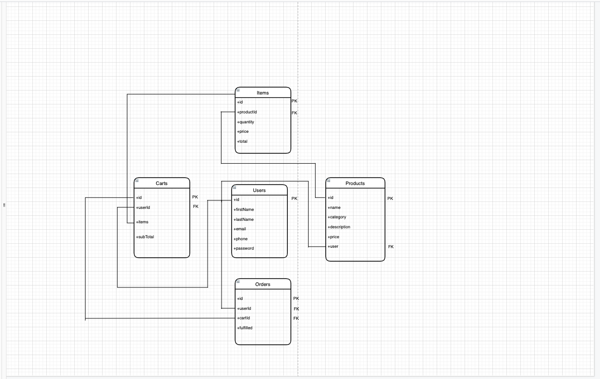

# e-commerce-app
A simple e-commerce application

[](https://travis-ci.org/ajimae/e-commerce-app) [](https://coveralls.io/github/ajimae/e-commerce-app?branch=develop)

<!-- 
This is a simple e-commerce application that let's users:

- Sign up an account
- Login to the account


- View available products
- Post their own products
- View a single product


- Add items to their shopping cart
- View all products items in their cart
- Remove a specific item from cart


- Make an order
- Cancel an order
- Get all order
- Fulfill an order -->


# Table of Contents

* [Technologies](#technologies)
 * [Features](#features)
 * [API Endpoints](#api-endpoints)
 * [Getting Started](#getting-started)
    * [Installation](#installation)
    * [Endpoints](#Endpoints)
    * [Testing](#testing)
    * [Development](#development)
    * [Schematics](#Schematics)


### API Deployment
API is deployed locally

## Technologies

* [NodeJS](https://nodejs.org/) - Runtime Environment
* [ExpressJs](https://expressjs.com/) - Web Application Framework
* [yarn](https://yarnpkg.com/) - Package Manager
* [Mongo DB](http://mongodb.com/) - Application database


### Supporting Packages

#### Compiler

* [Babel](https://babel.io/) - Compiler for ES6 Javascript

## Test Tools
* [Mocha](https://mochajs.org/) - JavaScript Test Framework for API Tests
* [Chai](https://www.chaijs.com/) - TDD/BDD Assertion Library for Node


## Features
 
### Users
* Sign up an account
* Login to the account

### Prdouct
* View available products
* Post their own products
* View a single product

### Cart
* Add items to their shopping cart
* View all products items in their cart
* Remove a specific item from cart

### Order
* Make an order
* Cancel an order
* Get all order
* Fulfill an order

## Getting Started

### Installation

* Clone the repository [e-commerce-app](https://github.com/ajimae/e-commerce-app.git).
* Run `yarn install` to install packages.
* Setup environment variables in your `.env`. 
  - See `.env.sample` for sample variable keys
* Run `docker-compose up` to build the docker containr and run the application.
* Default `base_url` is at `http://localhost/api/v1`

### Endpoints

#### Signup
```bash
url - http://localhost/api/v1/users
method: POST
request body: {
  "firstName": "firstName",
  "firstName": "firstName",
  "email": "email@mail.com",
  "password": "1234567890",
  "phone": "08012345678800"
}
```

#### Signin
```bash
url - http://localhost/api/v1/users
method: GET
request body: {
  "email": "email@mail.com",
  "password": "1234567890",
}
```

#### Product
```bash
url - http://localhost/api/v1/products
method: POST
Authorization: Bearer {{token}}
request body: {
  "name": "53\" Smart TV",
  "category": "electronics",
  "description": "Smart TV",
  "price": "85,000"
}

url - http://localhost/api/v1/products
method: GET

url - http://localhost/api/v1/product/{{productId}}
method: GET
```

#### Cart
```bash
url - http://localhost/api/v1/cart
method: GET
Authorization: Bearer {{token}}

url - http://localhost/api/v1/cart
method: POST
Authorization: Bearer {{token}}
request body: {
  "productId": "productId",
  "quantity": 1
}

url - http://localhost/api/v1/cart
method: PATCH
Authorization: Bearer {{token}}
request body: {
  "productId": ["productId-1", "productId-2", ...]
}
```


#### Order
```bash
url - http://localhost/api/v1/order
method: GET
Authorization: Bearer {{token}}

url - http://localhost/api/v1/order
method: POST
Authorization: Bearer {{token}}
request body: {
  "cartId": "cart-id"
}

url - http://localhost/api/v1/fulfill/{{orderId}}
method: POST
Authorization: Bearer {{token}}


url - http://localhost/api/v1/order/{{orderId}}
method: DELETE
Authorization: Bearer {{token}}
```

### Testing

#### Prerequisites

* [Postman](https://getpostman.com/) - API Toolchain
* [Rest-Client](https://marketplace.visualstudio.com/items?itemName=humao.rest-client) - VS Code http rest client

#### Testing with Postman

* After installing as shown above
* Navigate to `http://localhost/api/v1` in Postman to access the application endpoints.


#### Testing with Coverage Data

* After installation
* yarn test
* It will lint code, run test and display coverage data as generated by
  [nyc](https://github.com/nyc)

### Development
[babe-node](https://babeljs.io) helps to compile es6 codes to es5 before for production deployment.

### Schematics


